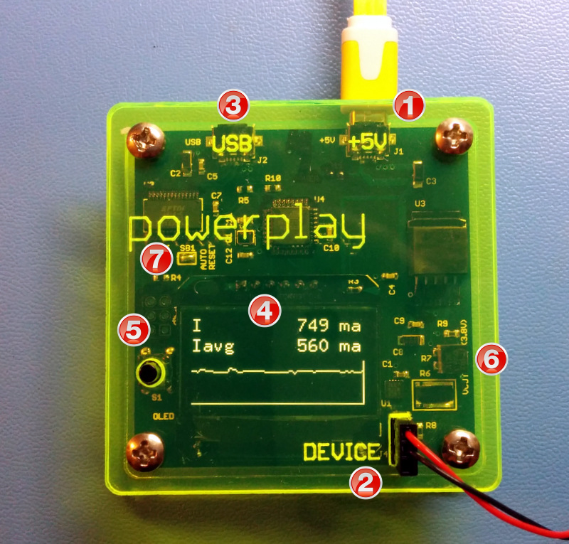
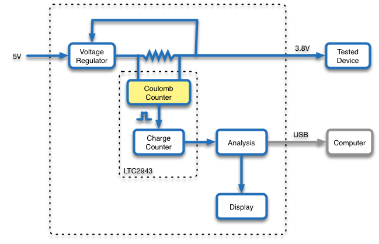
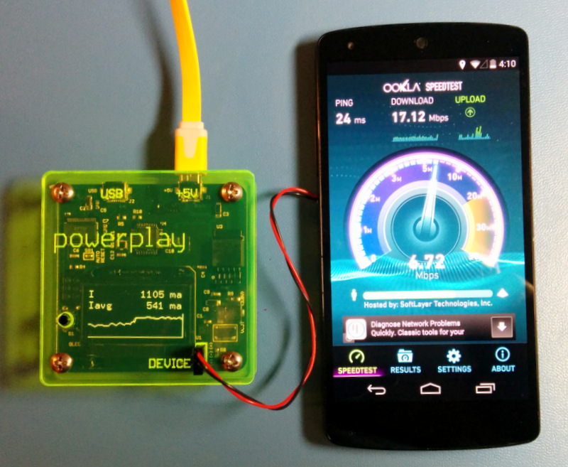
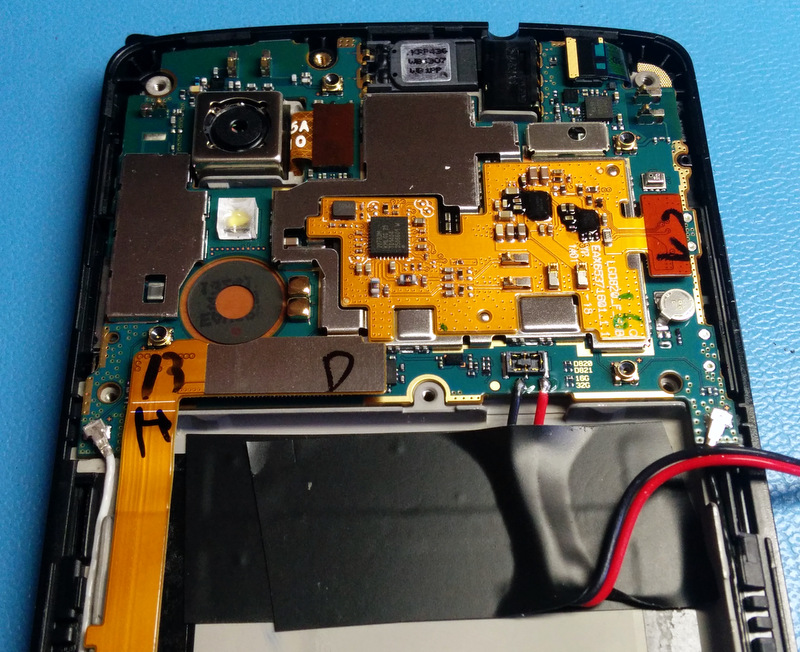
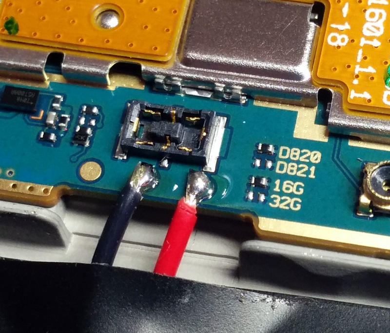
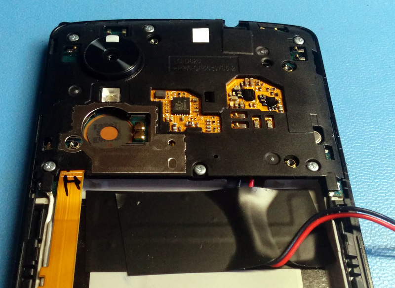
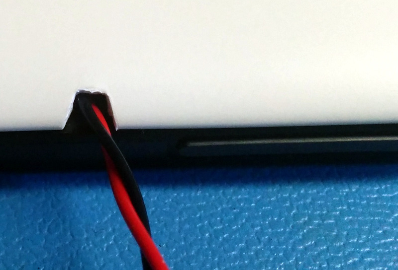

POWER PLAY 3V8
==============

## OVERVIEW
POWER PLAY 3V8 is an Arduino based measurement tool that is used to measure the power consumption of mobile devices under different conditions and software versions. It provides 3.8V 2A DC power that simulates a single cell Li-ion battery and is connected to the device **instead of the battery**. The POWER PLAY 3V8 analyzes the current pattern consumed by the device and provides aggregated data on an integral a 1.3" OLED display. It also output the data to a USB/Serial port so it can be logged by a computer for further analysis. The computer based logging is optional and in most cases not consumed since the POWER PLAY 3V8 provides the key results on the display in real time (e.g. the average current consumption over the measurement period).

**WARNING using the POWER PLAY 3.8V required modified devices with batteries removed. This modification should be done by qualified persons only due to the risk of fire, personal injury and even death. The POWER PLAY 3V8 information is provided here as-is and you must consult a qualified person before using it in any way. NEVER operate the POWER PLAY 3V8 with the battery connected to the device under test.**



1. +5V power input micro USB connector. This connector should be connected to a standard 5V charger and is used to power the POWER PLAY 3V8 and the device under test. It is important to use a charger that can provide sufficient current even during peak current consumption by the device under test. When testing a typical smart phone, powering the POWER PLAY 3V8 from a USB port or a small 1A charger typically result in insufficient current and unstable operation.

2. Power output connection to the device. This is a 3 pin standard servo connector (JR and Hitec style) with ground at the center pin and 3.8V DC (typical) at the two end pins (it's sufficient to use only one of them). This output voltage is adjustable (see below) and is connected to the device instead of the battery, emulating a single cell Lithium-ion battery.

3. USB connector. Using this connector is optional. It allows to log the raw data on an attached computer for later analysis. This connector implements a FTDI serial over USB port and can be access as a serial port on standard Mac OSX, Linux and Windows computers without additional drivers. The emulated serial port is 115.2kbs, 8 data bit, no parity and the data is in ASCII text format.

4. Display. This is a 1.3" monochrome OLED display that shows the analysis results. The display supports multiple pages with different data items.

5. Operation button. A short click switch the displayed data page and a long press (~4 seconds) resets the analysis variables and starts a new analysis session. Holding this button pressed while powering the POWER PLAY 3V8 activates the test screen (for post manufacturing tests).

6. This is a multi turn trim potentiometer that allows to adjust the output voltage in the range 3.6V - 4.2V. It is accessible from the side of the POWER PLAY 3V8 and requires a small flat screwdriver.

7. Auto Reset. This is a solder jumper on the PCB that controls the the USB auto reset feature. When shorted, establishing a new connection via the USB connector resets the POWER PLAY 3V8. This is useful when developing firmware for the POWER PLAY 3V8 using the Arduino IDE. If the auto reset is not desired (e.g. in order to have analysis sessions non interrupted by connecting the USB port), the short should be disconnected with a solder iron (after removing the 4 top screws and top cover).

TODO: add an overall picture with annotation for connectors, display, button and trim pot.

## FUNCTIONAL BLOCK DIAGRAM



* **Voltage regulator** - a 5V to 3.8v low dropout (LDO) voltage regulator. The output voltage (nominal 3.8V) can be set by the small multi turn potentiometer on the right hand of the device.
* **Shunt resistor** - this is a small (25 milliohms) 1% Kelvin resistor that is used to sample the current consumed the the device. The voltage drop on the shunt does not affect the output voltage of the POWER PLAY 3V8 because of the feedback loop between the output voltage and the LDO.
* **Coulomb counter** - this is an analog circuit that continuously integrate the current through the shunt resistor and generates a pulse ('tick') whenever the charge since the last tick reaches a predefined value. (charge is the integral of current over time and is measured in Ampere Hours). For more information read the LTC2943 datasheet at http://www.linear.com/product/LTC2943.
* **Charge counter** - this is a digital counter that counts the Coulomb counter ticks. It provides the long term current integration.
* **Analysis** - this is firmware that tracks the current patterns and computes real time summary data such as momentary current, accumulated charge, number of times device transitioned from standby to wake mode and so on.
* **Display** - a small 1.3" OLED display that display the analysis results. The display has several pages, each with different data items, that can be switched using the button.
* **Computer** - this is an optional computer that logs the data over a USB connection. In most cases, the results displayed on the OLED displayed are sufficient and the computer is not necessary. 

## CONNECTION DIAGRAM


Plug the +5V micro usb connector to a USB charger with sufficient current (e.g. 2A). Plug the modified device to the DEVICE connector. Optional: to log the data on a computer connect the USB port to a computer and run a logging program or script (the POWER PLAY 3V8 looks like a 115.2kbs FTDI serial over USB port).

## ANALYSIS

The POWER PLAY 3V8 performs the analysis by dividing the time into slots of 100ms each (10Hz). For each time slot the analysis firmware samples the number of charge ticks occurred in that time slot (partial ticks are rolled to the next time slots, avoiding integration errors) and tracks the total ticks and time in global analysis counters. These counters are reset when the analysis is reset by long pressing the button. These values are used to compute, report and display the following values among others:

* Charge in last time slot.
* Average current during last time slot.
* Last time slot classification (I < ~80ma ? 'standby' : 'wake').
* Total analysis time.
* Total analysis charge (AmpHour).
* Average current during the analysis period.
* Total times of 'wake' and 'standby' slots.
* Total charge in 'wake' and 'standby' slots.
* Number of transitions from a 'standby' to 'wake' time slot.

The most important value from the above list is the average current during the analysis since it is inversely proportional to the expected battery life (for a given battery capacity).

Note: the analysis also samples and reports the momentary voltage level at each slot but in general it assumes that the voltage is fixed and thus does not track power (Watt) or energy (Watt Hour).

## OPERATION

Operating the POWER PLAY 3V8 is very simple. Connect the POWER PLAY 3V8 to a 5V 2A charger and the device under test as described above, reset the analysis by long pressing the button (~4 seconds) and let the device operate under the desired conditions. The analysis is done is real time and the results are shown on the display. Click the button to switch between display pages to see the desired values. 

IMPORTANT: the charger must be able to provide the peak current of the device under test. Make sure to have a brand name charger with sufficient power capabilities (e.g. 2A or larger). If the charger cannot provides the peak current, the device will turn off occasionally. 



## LOG FORMAT
POWER PLAY output raw data for logging and offline analysis via the USB port. When connecting to a Linux, Mac OSC or Windows 
computer, the POWER PLAY appears as a serial port without having to install any special driver (it uses the default FTDI driver).
The serial port parameters are 115,200 bps, 8 data bit, no parity and it provides text based data (with CR/LF line ending)
with one record every 100 milliseconds. Each record contains the values listed below with a single space separator between
them.

```
8.200 0.131 0.000 0.163 0 8200 1 1
8.300 0.155 0.000 0.163 0 8300 1 1
8.400 0.131 0.000 0.163 0 8400 1 1
8.500 0.042 0.000 0.161 100 8400 1 0
8.600 0.018 0.000 0.159 200 8400 1 0
8.700 0.018 0.000 0.158 300 8400 1 0
8.800 0.012 0.000 0.156 400 8400 1 0
8.900 0.018 0.000 0.155 500 8400 1 0
9.000 0.030 0.000 0.153 600 8400 1 0
9.100 0.060 0.000 0.152 600 8500 2 1
9.200 0.042 0.000 0.151 700 8500 2 0
```

The fields of each log line are as follows

* **T** - Timestamp since the beginning of the analysis (long press the button) in milliseconds.
* **I** - Average current during the last 100ms time slot, in Amperes.
* **Q** - Total charge since the beginning of the analysis in Ampere/Hours.
* **Iavg** - Average current since the beginning of the analysis in millliamps.
* **Ts** - Total time since the beginning of the analysis of 100ms time slot that were classified as 'standby' (average current was lower than a predefined threshold.
* **Tw** - Total time since the beginning of the analysis of 100ms time slot that were classified as 'wake' (average current was higher than a predefined threshold. (this field is redundant since it is always equals T - Ts).
* **Nw** - number of transitions from a 'standby' (100ms) time slot to a 'wake' time slot. 
* **W** - a boolean flag that indicates if the last 100ms time slot was classified as 'wake' (value = 1) or as 'standby' (value = 0).

## INSTRUMENTING A DEVICE
The process of instrumenting a mobile device to be used with POWER PLAY 3.8V varies for each device and should be done only by qualified personal that understand the device and the hazards of dealing with rechargeable Li-Ion batteries (risk or fire, personal injury and death so **beware**). For that reason, it is in out of the scope of this document.

Following are the steps used to instrument one specific phone model (Nexus 5) that was used to test the POWER PLAY 3.8V. This is provided as general information only and not as a comprehensive guide. The procedure for other devices can be very different, some may require additional capacitors in parallel to the two wires, other can require special 'fake' batteries while others can be completely incompatible with POWER PLAY 3.8V.

1. Open the back cover (pry around)
2. Remove the black plastic cover above the battery (require removal of 6 small screws).
3. Carefully disconnect the battery connector and the large flex connector next to it.
4. Remove the battery (you need to pry below it, be careful not to damage the battery).
5. Place back the large flex cable.
6. Solder two wires to the points shown the in the picture below.
7. Put back the black cover and secure with the 6 screws.
8. Cut a small notch at the edge of the back cover to have clearance for the two wires.
9. Put back the black cover.
10. Solder the two wires to a 3 position HiTech/JR (but not Futaba) servo connector. Connect the center position to the (-) wires and one of the end positions to the (+) wire.


The Nexus 5 with cover and battery removed and two wires soldered.


A close up of the two connection points.


The phone with the black cover back in place and the wires secured with tape.


The exit point of the two wires.

## FIRMWARE DEVELOPMENT

POWER PLAY 3.8V is compatible with the Arduino IDE and its firmware is an Arduino sketch whose source code is available in this directory. Here are a few notes that will help you setup the development environment.

* You need to power the POWER PLAY 3.8V via its +5V connector in addition to connecting the USB port to the host computer with the Arduino IDE.
* The POWER PLAY 3.8V looks to the Arduino IDE as an Arduino Pro Mini 16Mhz 5V ATMEGA328 board. You need to select it in the Tool section of the IDE menu.
* You can use the IDE serial monitor facility to view output from the POWER PLAY 3.8V.
* The POWER PLAY 3.8V sketch uses the U8glib graphic library. You need to install it on your Arduino IDE before being to compile the POWER PLAY 3.8V sketch. To do so, follow the 'manual instructions' here https://code.google.com/p/u8glib/wiki/u8glib (using the IDE's library import function results in compilation errors).

## BUILDING POWER PLAY 3V8

Follow these steps to build your own POWER PLAY: 

* Purchase the electronic components listed in the Bill Of Material (BOM) file. Most components are available from common sources such as digikey.com. You can purchase the OLED display directly from heltec.cn or from retailers such as eBay sellers. Make sure to purchase a white SPI display with 6 pins that match the pins in the schema (these display use the SSD1306 controller).
* Order the printed circuit board (PCB). It is a 2 layers PCB with a Sick of Beige 60mm x 60mm form factor. Some vendors such as OSHPark.com accept Eagle .brd files directly. Others such as elecrow.com require you to generate gerber files using their custom Eagle .cam files.
* Order a SMD stencil (5mil or 0.125mm) for the PCB. For best results, use a metal stencil (e.g. from elecrow.com) rather than mylar.
(optional) Make the top and bottom laser cut covers. We got the best results with acrylic 1/8” fluoro blue or green. If you do not have access to a laser cutter, you can order online from services such as ponoko.com. 
* Print, pick-and-place and reflow the SMD components, including the two micro USB connectors (use solder paste, the stencil and the reflow method of your choice such as hot air station, hot plate or a toaster oven).
* Solder the through-hole components (two 1 pin OLED support posts, OLED display, push button, and 3 pin output header). Connecting the solder jumper SB1 is optional but recommended.
* Power the board via the +5V connector and use an ICSP programmer of your choice (e.g. Atmel ICSP MKII with pogo pins) to program the MCU  (see the script file icsp_program_all.sh for an example). Alternatively, you can program the MCU before soldering, using a universal programmer. This step programs the MCU fuses, the MCU Arduino bootloader, and the POWER PLAY firmware. 
* (optional) Assemble the top and bottom covers using the screws and spacers listed in the BOM. If not using the covers, you can use screws and nuts to have the PCB standing on 4 legs.

